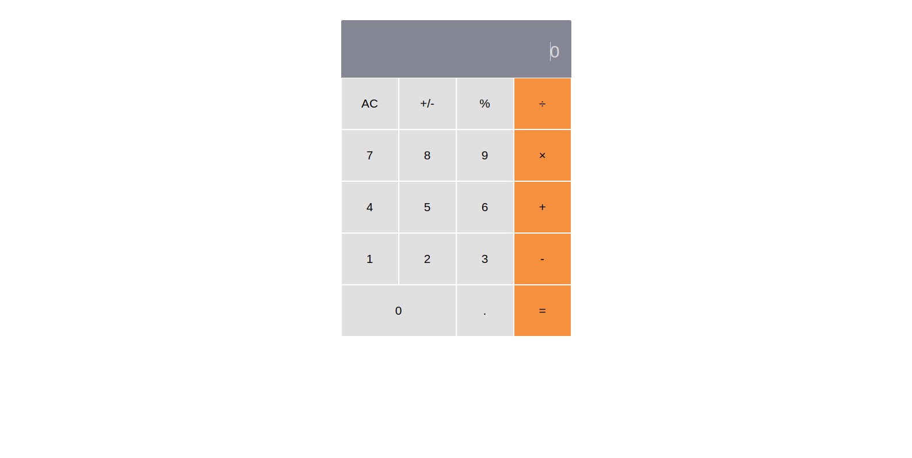

# Math Magicians

> It's an awesome calculator, you can add, divide, subtract, and multiply numbers

## Built With

- CSS
- ReactJS
- Linters

# Live Demo
[Demo](https://math-magicians.pages.dev/)
### Prerequisites
  #### Knowledge of these technologies
    * HTML, CSS
    * JS & ECMA 6
    * Reactjs
### Setup
    * Open your command
    * Type "git clone https://github.com/ahmed-al-farouq/math-magicians.git"
    * npm i
    * npm run start
### Install
    * npm run start

### Deployment
    * npm run build

## Author

:bearded_person: **Ahmed Al-Farouq**
  - Github: [@Ahmed-Alfarouq](https://github.com/ahmed-al-farouq)
  - LinkedIn: [LinkedIn](https://www.linkedin.com/in/ahmed-al-farouq/)
  - Twitter: [@twitter](https://twitter.com/ahmed_al_farouq)

## 🤝 Contributing

Contributions, issues, and feature requests are welcome!

Feel free to check the [issues page](../../issues/).

## Show your support

Give a ⭐️ if you like this project!

## 📝 License

This project is [MIT](./MIT.md) licensed.
